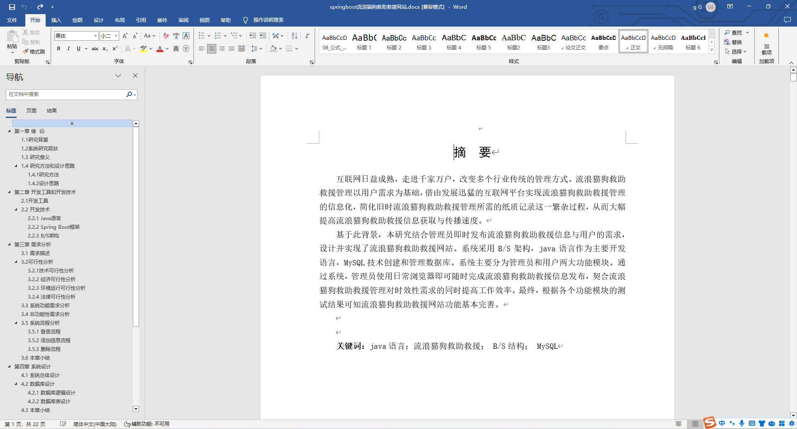
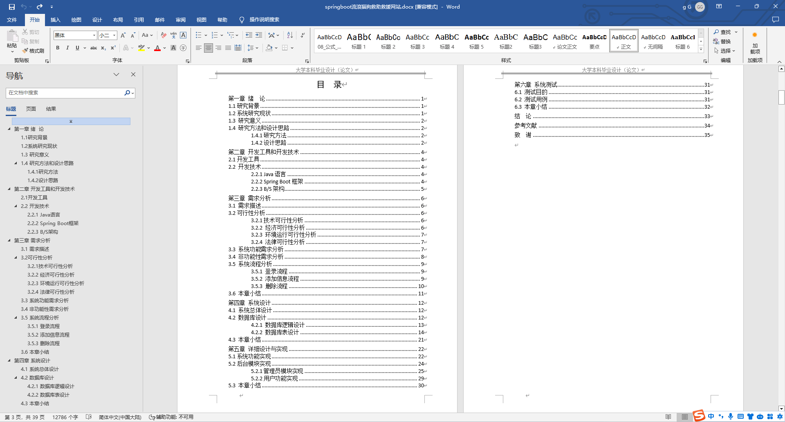
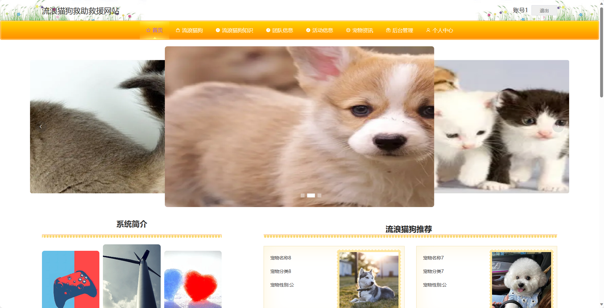
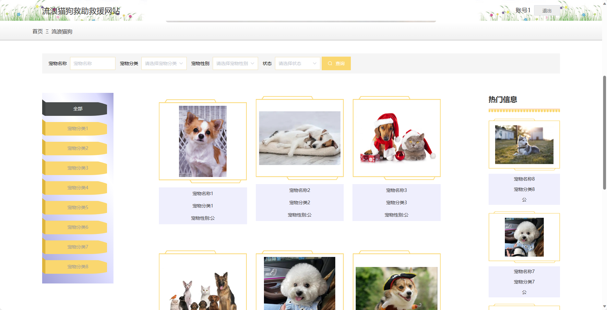
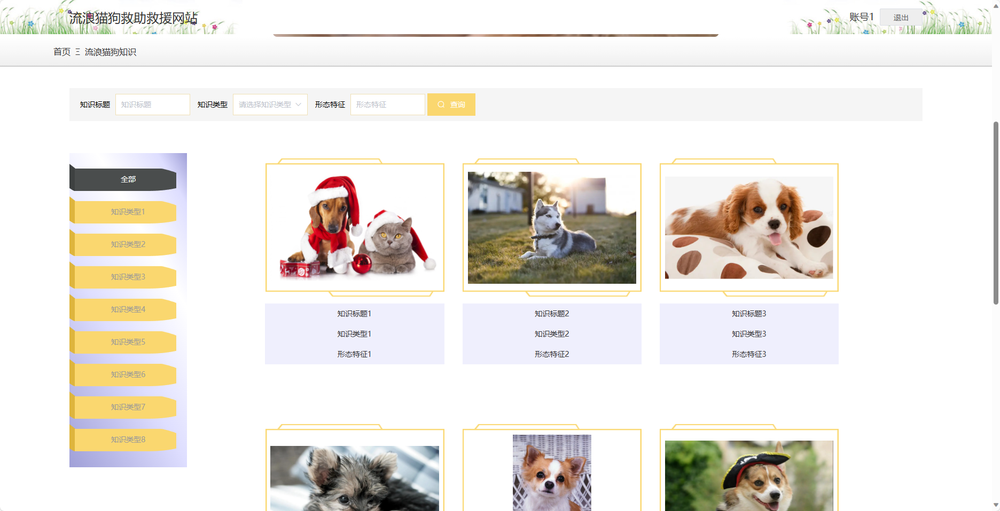
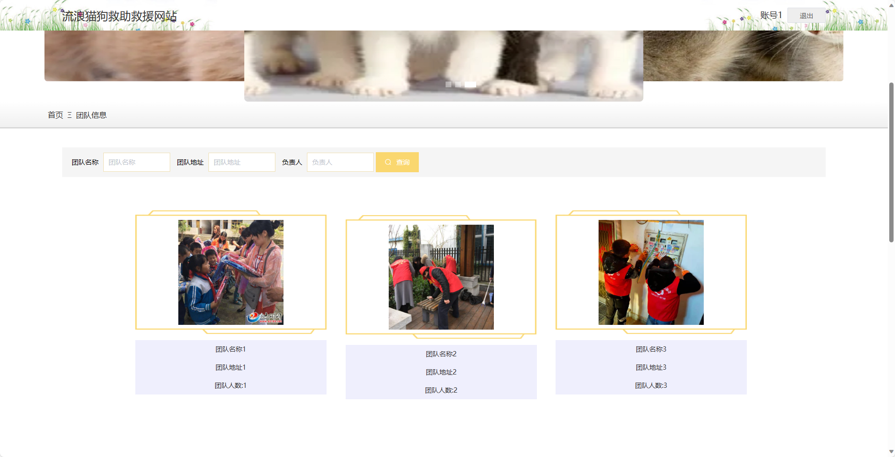
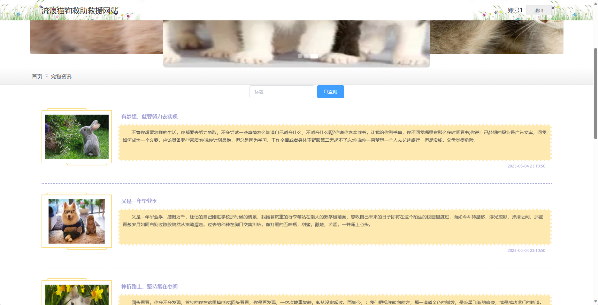
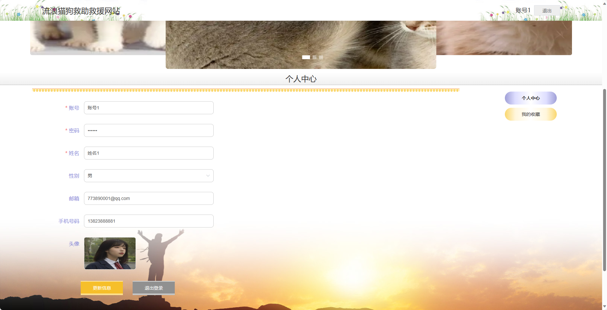
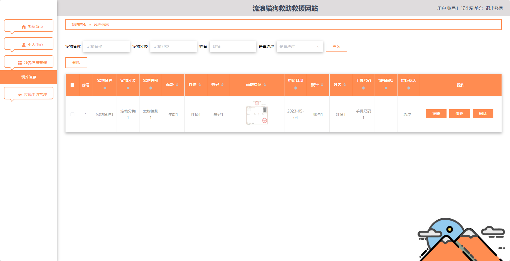

基于SpringBoot的流浪猫狗救助救援网站（程序+论文）
=
- 完整代码获取地址：从戎源码网 ([https://armycodes.com/](https://armycodes.com/))
- 作者微信：19941326836  QQ：952045282 
- 承接计算机毕业设计、Java毕业设计、Python毕业设计、深度学习、机器学习
- 选题+开题报告+任务书+程序定制+安装调试+论文+答辩ppt 一条龙服务
- 所有选题地址https://github.com/nature924/allProject

一、项目介绍
---
基于Spring Boot框架实现的流浪猫狗救助救援网站，系统包含两种角色：管理员、用户,系统分为前台和后台两大模块，主要功能如下。

### 前台：

1. 首页：展示网站的概览信息，。
2. 流浪猫狗：展示流浪猫狗的相关信息。
3. 流浪猫狗知识：提供关于流浪猫狗的知识文章。
4. 团队信息：展示救助团队的相关信息。
5. 活动信息：提供关于流浪猫狗救助救援的最新活动信息。
6. 宠物资讯：提供关于宠物养护、健康等方面的资讯。
7. 个人中心：用户可以管理个人信息。

### 后台：

### 管理员：
1. 个人中心：管理员可以管理个人信息，包括修改密码等操作。
2. 用户管理：管理员可以管理用户信息，包括查看用户列表、添加、编辑、删除等操作。
3. 宠物分类管理：管理员可以管理宠物的分类信息，包括查看分类列表、添加、编辑、删除等操作。
4. 知识类型管理：管理员可以管理知识文章的分类信息，包括查看分类列表、添加、编辑、删除等操作。
5. 流浪猫狗管理：管理员可以管理流浪猫狗的信息，包括查看流浪猫狗列表、添加、编辑、删除等操作。
6. 领养信息管理：管理员可以管理领养信息，包括查看领养列表、添加、编辑、删除等操作。
7. 流浪猫狗知识管理：管理员可以管理流浪猫狗知识的文章，包括查看文章列表、添加、编辑、删除等操作。
8. 团队信息管理：管理员可以管理救助团队的信息，包括查看团队列表、添加、编辑、删除等操作。
9. 活动分类管理：管理员可以管理活动的分类信息，包括查看分类列表、添加、编辑、删除等操作。
10. 活动信息管理：管理员可以管理活动的信息，包括查看活动列表、添加、编辑、删除等操作。
11. 志愿申请管理：管理员可以管理用户的志愿申请，包括查看申请列表、审批申请等操作。
12. 系统管理：管理员可以管理系统的参数设置、日志查看等功能。

二、项目技术
---
- 编程语言：Java
- 数据库：MySQL
- 项目管理工具：Maven
- 前端技术：VUE、HTML、Jquery、Bootstrap
- 后端技术：Spring、SpringMVC、MyBatis

三、运行环境
---
- 操作系统：Windows、macOS都可以
- JDK版本：JDK1.8以上都可以
- 开发工具：IDEA、Ecplise、Myecplise都可以
- 数据库: MySQL5.7以上都可以
- Tomcat：任意版本都可以
- Maven：任意版本都可以

四、运行截图
---
### 论文截图：

### 程序截图：

